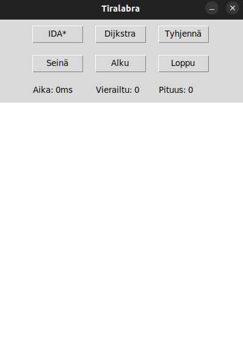

# Käyttöohje

Lataa viimeisin versio [täältä](https://github.com/Perttu-Kangas/tiralabra/releases/latest/).

### Ohjelman käynnistäminen
1. Asenna riippuvuudet ``poetry install``
2. Käynnistä sovellus ``poetry run invoke start``

### Käyttäminen
Käynnistäessä sovellus avautuu seuraavan näkymään:  

Näkymässä on 6 painiketta:
* IDA*: suorita IDA* nykyiselle kartalle
* Dijkstra: suorita Dijkstra nykyiselle kartalle
* Tyhjennä: tyhjennä koko kartta
* Seinä: valitse seinä piirtotyökaluun
* Alku: valitse aloituspiste piirtotyökaluun
* Loppu: valitse loppupiste piirtotyökaluun

Käytännössä haluat ensiksi painaa `Alku`, jonka jälkeen valitset
aloituspisteen, sitten `Loppu`, jonka jälkeen valitset lopetuspisteen.
Sitten voi vielä piirtää seiniä valitsemalla ensin `Seinä`.  

Tämän jälkeen voi valita kumpi algoritmi suoritetaan piirrettyyn karttaan.