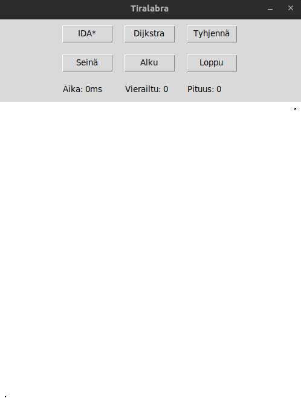
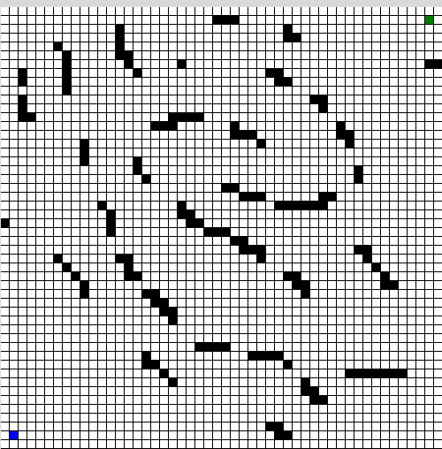
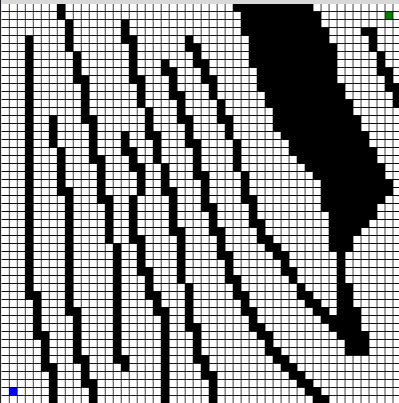

# Testausdokumentti

## Yksikkötestaus

Yksikkötestit voidaan suorittaa komennolla `poetry run invoke test`. Testikattavuusraportin
voi tehdä komennolla `poetry run invoke coverage-report`

Yksikkötestit ovat melko kattavat, kuten [testikattavuudesta](https://perttu-kangas.github.io/tiralabra/htmlcov/) näkyy.

## Algoritmien testaus

Yksikkötestien lisäki algoritmien toimintaa on testattu seuraavilla syötteillä.
Testattu siis, että pituus on oikein koodin puolella.

#### Tyhjä 500x500 ruudukko, missä yhden ruudun koko on 1
Vasen alanurkka aloituspiste (11, 487), ja oikea ylänurkka lopetuspiste (490, 12).  

#### Vähäisesti seiniä sisältävä 500x500 ruudukko, missä yhden ruudun koko on 10
Vasen alanurkka aloituspiste (1, 48), ja oikea ylänurkka lopetuspiste (48, 1).  

#### Paljon seiniä sisältävä 500x500 ruudukko, missä yhden ruudun koko on 10
Vasen alanurkka aloituspiste (1, 48), ja oikea ylänurkka lopetuspiste (48, 1).  
HUOM. tämä toistettiin vain `5` kertaa kummallekkin algoritmille `100` sijasta, koska
IDA* hyvin todennäköisesti ei löydä nopeasti reittiä. IDA* etsintäaika on rajattu 10s.

Kuten arvelin, niin IDA* tässä palautti aina -1, eli ei löytänyt reittiä 10s.