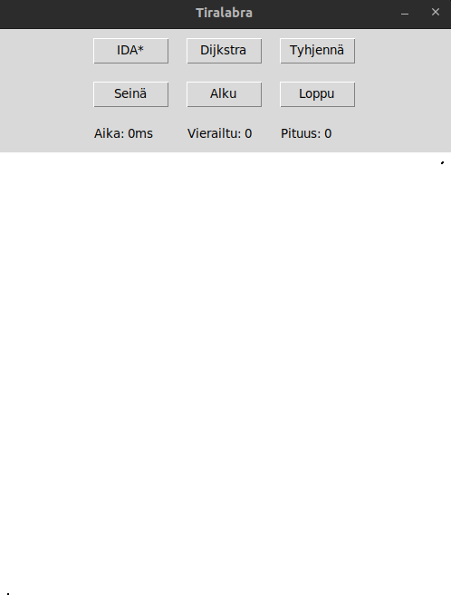

# Toteutusdokumentti

## Ohjelman yleisrakenne
```
index.py
  entities
    dijkstra.py: vastaa Dijkstra toiminnasta
    idastar.py: vastaa IDA* toiminnasta
  services
    algorithm_ticker.py: vastaa algoritmien statistiikasta sekä juoksemisesta
    ui_logic.py: vastaa kaikesta ui logiikasta
  tests
    kaikki testit
  ui
    main_view.py: ohjelman päänäkymä
    ui.py: apuluokka helpottamaan mahdollisesti uusien näkymien tekemistä
  util
    coordinates_helper.py: pieniä apumetodeja helpottamaan koordinaattien kanssa
    enums.py: enumeita määrittelemään gridin tyyppejä sekä algoritmien tuloksia
    heap.py: minimikeko toteutus
```

## Saavutetut aika- ja tilavaativuudet

#### IDA*

Aikavaativuus: IDA*:n aikavaativuutta ei suoraan voi määritellä, se riipuu hyvin paljon heuristiikan toimivuudesta,
ja ongelmasta. Sillä IDA* ei pidä muistissa parhaita polkuja uuden iteraation alkaessa suuremmalla rajalla, 
se joutuu käymään samoja solmuja monta kertaa läpi. Aikavaativuudeksi voi kuitenkin yleisesti sanoa `O(n^m)`, missä
n on haarautuvuus (4), ja m on ensimmäinen hakusyvyys.
Tilavaativuus: Muistissa pidetään vain nykyistä polkua, jolloin sen tilavaatisuus on `O(n)`, missä
n on nykyinen arvio hinnasta löytää loppupiste.

#### Dijkstra

Aikavaativuus: Algoritmi käy läpi kaikki solmut ja kaaret, mikä on `O(n + m)`. Pahimassa tapauksessa kekoon lisäämiset
vievät aikaa `O(m log m)`, sekä poistot `O(m log m)`. Saadaan siis `O(n + m log m)`, minkä voi vielä siistiä oletuksella,
ettei kahdella kaarella ole samaa alku- ja loppusolmua. Tällöin `m <= n²`, joten `log m <= log(n²) = 2 log n`,
jolloin aikavaativuus on `O(n + m log n)`.  
Tilavaativuus: Pahimmassa tapauksessa muistissa on kaikki solmut talletettuna `dist` ja `heap`, jolloin tilavaativuus on `O(n + m)`.

## Suorityskyky- ja O-analyysivertailu

Jokaisessa vertailussa testit on suoritettu `100` kertaa, paitsi paljon seiniä olevassa `5` kertaa.

#### Tyhjä 500x500 ruudukko, missä yhden ruudun koko on 1
Vasen alanurkka aloituspiste (11, 487), ja oikea ylänurkka lopetuspiste (490, 12).  


IDA*
```
total: visits=190400, time=2181.782934ms
avg: visits=1904.0, time=21.81782934ms
```
Dijkstra:
```
total: visits:24978000, time=134554.799284ms
avg: visits=249780.0, time=1345.54799284ms
```

#### Vähäisesti seiniä sisältävä 500x500 ruudukko, missä yhden ruudun koko on 10
Vasen alanurkka aloituspiste (1, 48), ja oikea ylänurkka lopetuspiste (48, 1).  


IDA*
```
total: visits=260600, time=707.333865ms
avg: visits=2606.0, time=7.073338649999999ms
```
Dijkstra:
```
total: visits=234700, time=1014.9619899999999ms
avg: visits=2347.0, time=10.1496199ms
```

#### Paljon seiniä sisältävä 500x500 ruudukko, missä yhden ruudun koko on 10
Vasen alanurkka aloituspiste (1, 48), ja oikea ylänurkka lopetuspiste (48, 1).  
HUOM. tämä toistettiin vain `5` kertaa kummallekkin algoritmille `100` sijasta, koska
IDA* hyvin todennäköisesti ei löydä nopeasti reittiä. IDA* etsintäaika on rajattu 10s.  


IDA*
```
total: visits=19916680, time=50000.096118999994ms
avg: visits=3983336.0, time=10000.019223799998ms
```
Dijkstra:
```
total: visits=9055, time=41.231396ms
avg: visits=1811.0, time=8.2462792ms
```

#### Yhteenveto

IDA*:n suurin etu on sen vähäinen muistinkäyttö, sillä tiedossa on vain nykyinen polku.
Kuitenkin IDA* on myös huomattavasti parempi vaihtoehto, jos tiedetään ettei esteitä ole paljoa 
ja/tai, että alueen koko on pieni. Dijkstra on silti yleisesti varmempi vaihtoehto, sillä esimerkikiksi 
jos esteitä on paljon, niin IDA* ei välttämättä löydä järkevässä ajassa loppupistettä.

## Työn mahdolliset puutteet ja parannusehdotukset

Työhön voisi lisätä A*, joka on käytännössä Dijkstra heuristiikalla. IDA* voisi myös lisätä enemmän ja parempia
heuristiikkoja. Kartan lataus netistä olisi myös hyvä lisä sekä alueen koon muuttaminen suoraan käyttöliittymästä.
Lisäksi mahdollisesti voisi lisätä maastoa, jossa siirtymiset 1:n sijasta olisivat raskaampia (esim. 3), jolloin Dijkstran
minimikeolla olisi käyttöä, nyt sillä ei käytännössä ole.

## Lähteet
* [https://en.wikipedia.org/wiki/Iterative_deepening_A*](https://en.wikipedia.org/wiki/Iterative_deepening_A*)
* [https://en.wikipedia.org/wiki/Dijkstra's_algorithm](https://en.wikipedia.org/wiki/Dijkstra%27s_algorithm)
* [https://www.cs.helsinki.fi/u/ahslaaks/tirakirja/](https://www.cs.helsinki.fi/u/ahslaaks/tirakirja/)